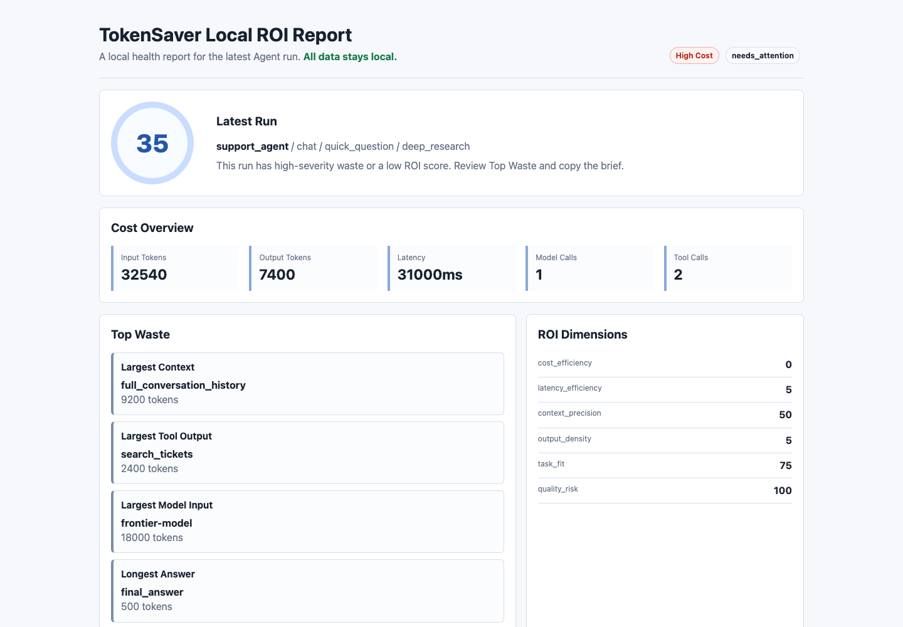

# TokenSaver

[](https://github.com/zhangtao-jayce/TokenSaver/actions/workflows/ci.yml)
[](https://www.python.org/)
[](LICENSE)
[](#privacy-by-default)

**Find wasted context, tool calls, model calls, and workflow routes in AI agents, locally. Then generate a repair brief for Codex or Claude Code.**

TokenSaver records real Agent runs, diagnoses low-ROI patterns with deterministic local rules, and produces an offline report showing what to repair next.

```text
Agent run -> Local trace -> ROI diagnosis -> Repair brief -> Before/after comparison
```

No hosted account. No required LLM call. No prompt or trace upload by default.



## See It In 30 Seconds

```bash
python3 -m pip install --upgrade \
  git+https://github.com/zhangtao-jayce/TokenSaver.git

tokensaver demo
```

The offline demo writes a before/after benchmark and local HTML panel to `.tokensaver-demo/`.

```text
Input tokens: 32540 -> 2460 (-92.4%)
Output tokens: 7400 -> 580 (-92.2%)
Latency: 31000 -> 1700 (-94.5%)
ROI score: 35 -> 100 (+65)
Result: ACCEPTED
```

These numbers come from the bundled deterministic demo fixture. They demonstrate the workflow and are not a claim about every Agent application.

## What It Finds

TokenSaver currently detects patterns such as:

- short requests routed through deep research workflows
- oversized or repeated context
- raw tool payloads and repeated uncached tool calls
- excessive model input and ReAct loop amplification
- slow tools, latency budget violations, and missing fallbacks
- answers that are too long for the delivery channel
- quality guardrail regressions during optimization

It writes:

```text
.tokensaver/
  runs.jsonl
  reports/latest.md
  briefs/latest.md
  panel/index.html
```

## Integrate With A Coding Agent

Paste this into Codex or Claude Code inside your Agent repository:

```text
Integrate TokenSaver into this Agent application:
https://github.com/zhangtao-jayce/TokenSaver

Find the user-message entrypoint, trace route/context/tool/model/final-answer
data for each run, keep all data local, run one test request, and show:
- .tokensaver/reports/latest.md
- .tokensaver/briefs/latest.md
- .tokensaver/panel/index.html
```

The detailed integration prompt and verification checklist are in [docs/集成指南.md](docs/集成指南.md).

## Minimal Python Integration

```python
from tokensaver import TokenSaver
from tokensaver.integrations import trace_openai_chat_completion

tokensaver = TokenSaver(app="my-agent", channel="chat")

def handle_message(message: str) -> str:
    with tokensaver.run(user_message=message) as run:
        run.set_task(task_type="quick_question", route="default")
        run.add_context("ticket", load_ticket(message), kind="crm")

        response = trace_openai_chat_completion(
            run,
            client=openai_client,
            model="gpt-4.1-mini",
            messages=[{"role": "user", "content": message}],
        )
        answer = response.choices[0].message.content
        run.record_final_answer(answer)
        return answer
```

Dependency-free adapters are included for:

- OpenAI Chat Completions and Responses
- Anthropic Messages
- LiteLLM
- LangChain and LangGraph callbacks
- framework-agnostic callbacks
- TypeScript and Vercel AI SDK JSON imports

## Compare A Repair

After changing the Agent workflow, record an equivalent run and compare it:

```bash
tokensaver compare \
  --before BEFORE_RUN_ID \
  --after AFTER_RUN_ID
```

TokenSaver reports token, latency, ROI score, resolved findings, new findings, and quality blockers. An optimization is rejected when it introduces tracked quality regressions.

## CLI

```bash
# Product demo
tokensaver demo

# Installation and environment checks
tokensaver version --verbose
tokensaver doctor
tokensaver init-profile --template coding-agent

# Record and inspect a run
tokensaver record-run --file examples/run.json
tokensaver latest --kind summary
tokensaver latest --kind brief
tokensaver latest --kind panel

# Analyze multiple runs
tokensaver list --limit 20
tokensaver top-tools --last 50
tokensaver compare --before RUN_ID --after RUN_ID
```

If the console script is not on `PATH`, use `python3 -m tokensaver.cli` in place of `tokensaver`.

## Profiles

Profiles keep project-specific budgets and quality requirements outside application code:

```yaml
app: my_agent
channel: chat
budgets:
  quick_question:
    input_tokens: 3000
    output_tokens: 500
    latency_ms: 20000
required_fields:
  quick_question:
    - conclusion
    - next_action
```

Built-in templates:

```text
chatbot, coding-agent, crm-agent, finance-assistant,
legal-assistant, research-agent, support-bot
```

## MCP

Start the dependency-free stdio server:

```bash
tokensaver-mcp
```

Main tools include:

- `tokensaver.plan_task`
- `tokensaver.record_agent_run`
- `tokensaver.diagnose_roi`
- `tokensaver.generate_repair_brief`
- `tokensaver.eval_fixtures`
- `tokensaver.doctor`

## Privacy By Default

TokenSaver is local-first:

- prompts, context, traces, and tool results are not uploaded by default
- the core diagnosis loop does not call an LLM
- stored traces omit raw context and tool text after estimating their size
- the HTML panel is a static offline file

See [OPEN_SOURCE_SCOPE.md](OPEN_SOURCE_SCOPE.md) and [SECURITY.md](SECURITY.md) for the current boundary.

## Project Status

TokenSaver is beta software. The local trace, diagnosis, repair brief, comparison, GUI panel, integration helpers, CLI, and MCP server are implemented. It is not currently a hosted observability platform or automatic LLM gateway.

Useful project documents:

- [Integration guide](docs/集成指南.md)
- [Changelog](CHANGELOG.md)
- [Contributing](CONTRIBUTING.md)
- [Open-source scope](OPEN_SOURCE_SCOPE.md)

## Development

```bash
git clone https://github.com/zhangtao-jayce/TokenSaver.git
cd TokenSaver
python3 -m unittest discover -s tests
python3 -m py_compile tokensaver/*.py
python3 -m tokensaver.cli demo --store-dir /private/tmp/tokensaver-demo
```

Contributions that improve real Agent integrations, diagnosis rules, benchmark fixtures, and before/after case studies are especially useful.
